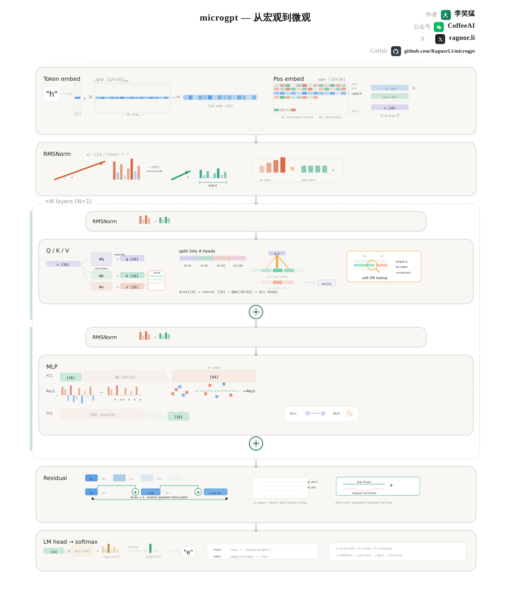

# microgpt

A **small-model, low-abstraction** walkthrough of what a GPT-style language model actually does: how data enters the network, how tensors flow, and how the loss backpropagates. It pairs a **single-page visual map** with **incremental code** from simple statistics to a full GPT-style stack.



The diagram above is a static view; the interactive version lives in [`microgpt_final.html`](microgpt_final.html) (open it locally in a browser).

---

## What this repo is

- **Code:** [`gpt2.py`](gpt2.py) trains a compact GPT-style model using a handwritten scalar autograd (`Value`) on character-level data. Comments compress the training objective, the `[B, T, C]` shape story, and the rest of the story into a few lines.
- **Diagram:** [`microgpt_final.html`](microgpt_final.html) lays out the full forward path—token and position embeddings, RMSNorm, attention, MLP, logits and softmax—so you can read the architecture top to bottom.

---

## Why it’s easy to follow

1. **Step-by-step breakdown**  
   The [`steps/`](steps/) folder walks from `Step1` through `Step7` (bigram stats → bigram NN → autograd → MLP with context → single-head attention → full GPT). Each step adds one idea and lines up with the final [`gpt2.py`](gpt2.py).

2. **Beginner-friendly**  
   Start from the picture and a minimal runnable script, then lean on the math and implementation notes in the code—no need to swallow the whole framework on day one.

---

## Viewing the HTML diagram

Clone the repo and open `microgpt_final.html` in the browser (double-click or drag onto the window). On GitHub, the file view shows source; for a hosted preview, use [GitHub Pages](https://pages.github.com/) or any static host and deploy the folder as-is.

---

## Training (optional)

With PyTorch and other dependencies installed:

```bash
python gpt2.py
```

If `input.txt` is missing, the script downloads the sample names dataset from the [makemore](https://github.com/karpathy/makemore) example on first run.
